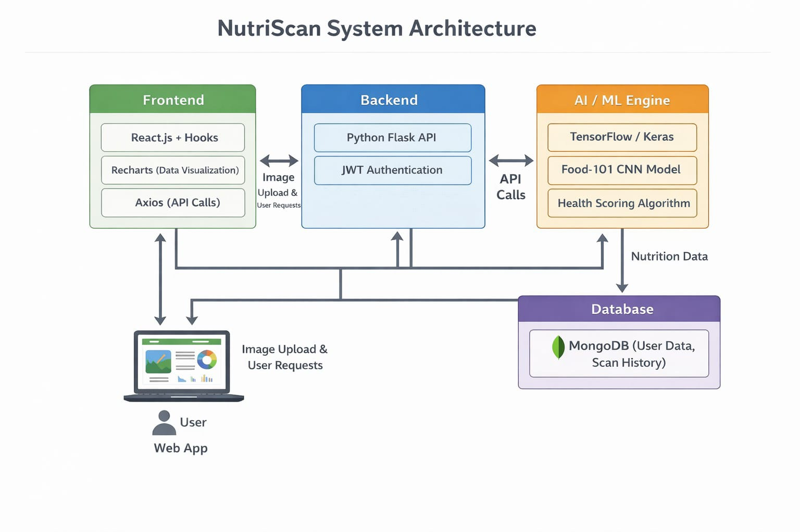
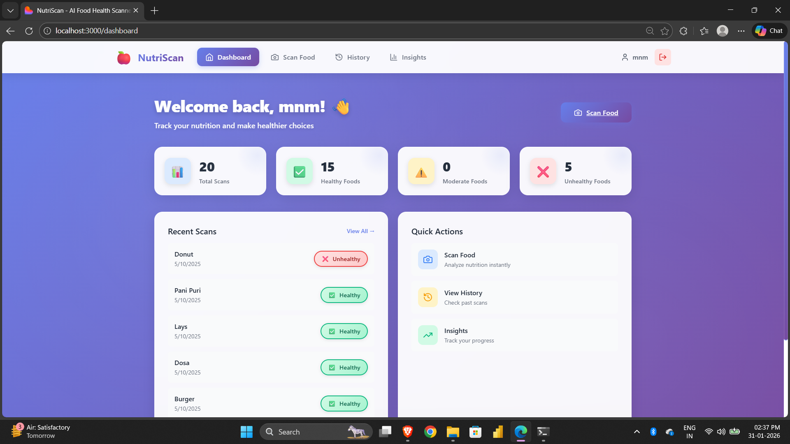
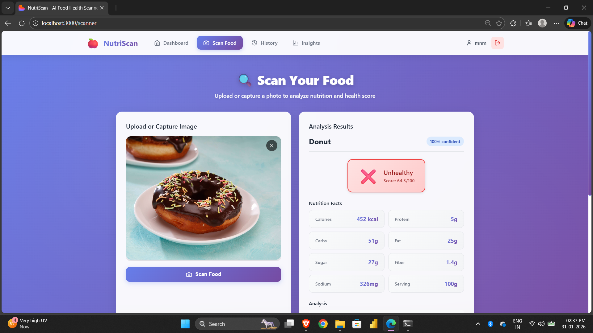
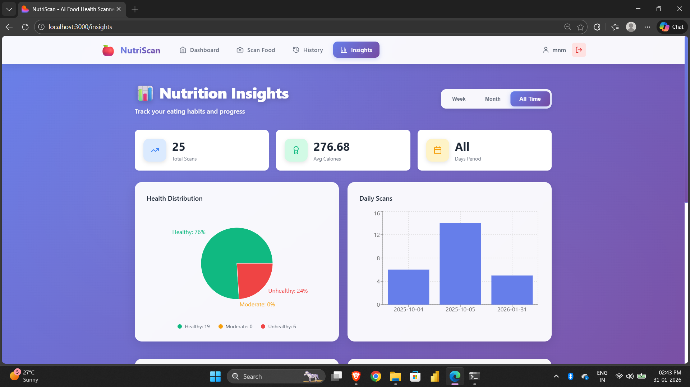
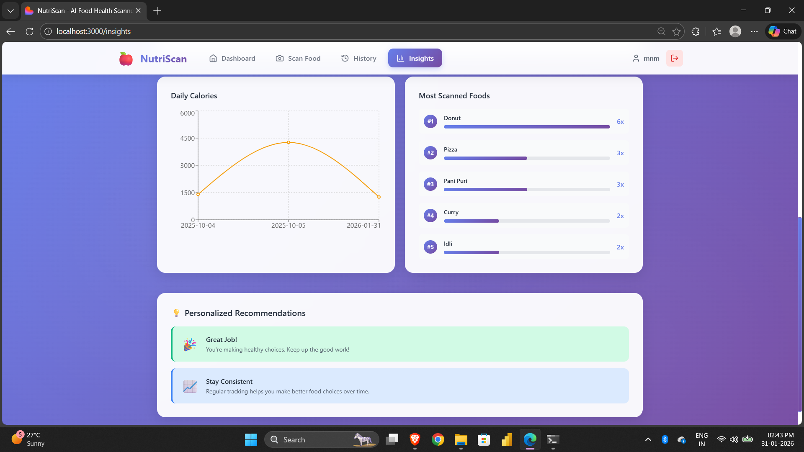

# 🍎 NutriScan – AI-powered Food Health Scanner

An intelligent food recognition and nutrition analysis application that helps users make healthier food choices.
NutriScan combines computer vision and deep learning to transform food images into meaningful nutritional insights.
The application delivers an intuitive dashboard that helps users understand their eating habits through visual analytics.
It is designed as a scalable, secure web application suitable for real-world health and wellness use cases.

---

## 🔹 Features

- **Food Recognition**: Upload or scan food images using AI-powered image classification
- **Real-Time Camera Scanning**: Capture food photos directly from your camera (NEW!)
- **Nutrition Analysis**: Get detailed nutritional information (calories, sugar, fat, protein, etc.)
- **Health Score**: Automatic classification as Healthy/Moderately Healthy/Unhealthy
- **User Dashboard**: Track scanned foods, view history, and nutrition insights
- **Smart Suggestions**: Get healthier food alternatives
- **Visual Analytics**: Weekly/monthly nutrition charts and trends

---

## 🔹 Tech Stack

### Frontend
- React.js with modern hooks
- CSS3 for styling
- Recharts for data visualization
- Axios for API calls

### Backend
- Python Flask REST API
- TensorFlow/Keras for ML model
- JWT authentication

### Database
- MongoDB for flexible data storage
- User profiles, scan history, and food data

### AI/ML
- Pre-trained CNN model (Food-101 dataset)
- Custom health scoring algorithm

---

## System Architecture 
The NutriScan system follows a modular web-based architecture with clear separation between frontend, backend, AI/ML engine, and database layers. The frontend communicates with the backend through secure REST APIs, while the backend orchestrates authentication, image processing, and data flow. The AI/ML engine performs food recognition and health scoring, with all user and scan data securely stored in a MongoDB database.

---
## 🔄 User Flow
1. User opens app → uploads/scans food image 📸
2. ML model predicts food item (e.g., "Pizza")
3. Backend fetches nutrition data from API
4. Health scoring engine evaluates the food
5. Frontend displays results with health status
6. Data saved to user's history for tracking

## 🎯 Health Scoring Rules

- **Healthy** ✅: Calories < 400, Sugar < 15g, Fat < 10g
- **Moderately Healthy** ⚠️: Calories < 600, Sugar < 25g, Fat < 20g
- **Unhealthy** ❌: Above moderate thresholds

---

## Screenshots
### Dashboard 

### Scan Food using Image 

  
  

### Real Time Scanning

  
  

### Scan History 

### Insights 

  
  

---

Quick start 
[QUICK_START.md](/QUICK_START.md)
